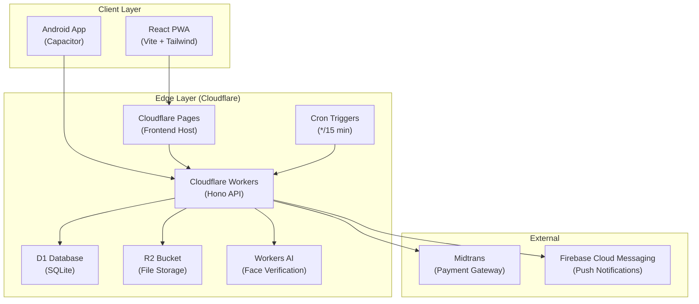
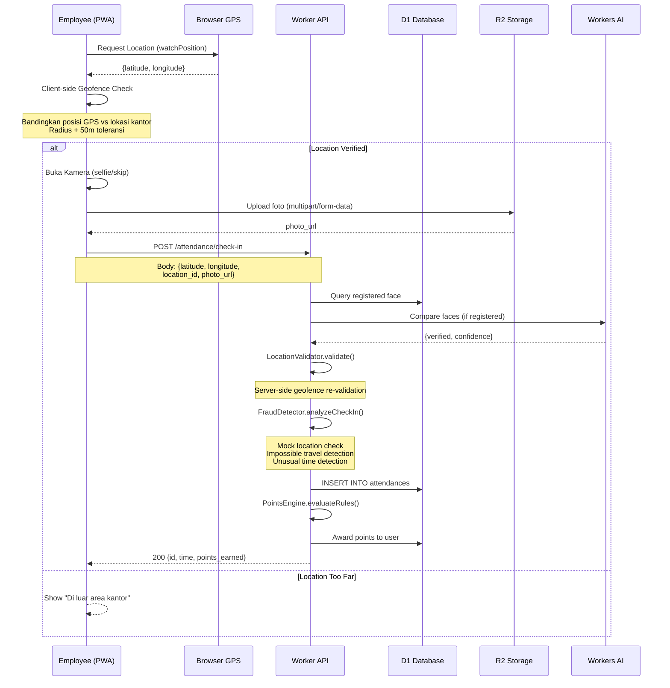
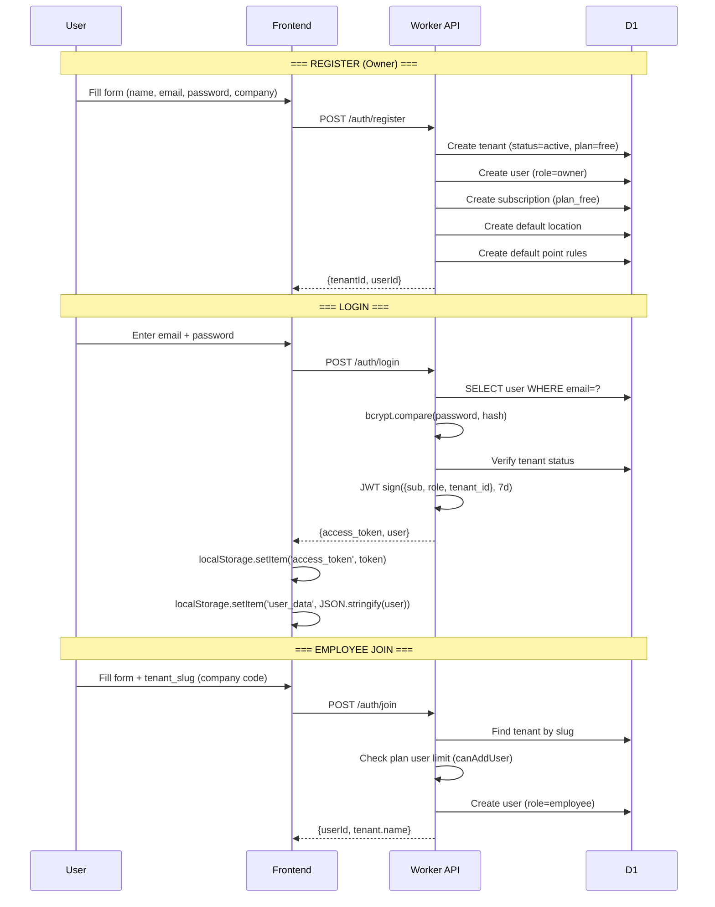

# 📘 Buku Panduan Standar Implementasi — Aplikasi Absensi (WorkPulse)
## Component Blueprint v2.1 — Part 1/2

> **Dokumen ini adalah standar baku arsitektur, desain, dan integrasi** untuk modul absensi multi-tenant SaaS. Tujuannya agar modul ini bersifat **plug-and-play** dan dapat diimplementasikan ke berbagai aplikasi dengan konsistensi penuh.

---

## 📋 Daftar Isi — Part 1

1. [Tech Stack & Konvensi Proyek](#1-tech-stack--konvensi-proyek)
2. [Arsitektur & Alur Sistem (System Flow)](#2-arsitektur--alur-sistem)
3. [Standar UI/UX & Layout (Design System)](#3-standar-uiux--layout-design-system)
4. [Spesifikasi API & Database](#4-spesifikasi-api--database)

---

## 1. Tech Stack & Konvensi Proyek

| Layer | Teknologi | Versi |
|-------|-----------|-------|
| **Frontend Framework** | React + TypeScript | React 19, TS 5.9 |
| **Build Tool** | Vite | 7.x |
| **UI Styling** | Tailwind CSS | 3.4 |
| **Icons** | `react-icons` (Material Design) | 5.x |
| **Routing** | React Router DOM | 7.x |
| **HTTP Client** | Axios | 1.x |
| **Charts** | Recharts | 3.x |
| **Maps** | React Leaflet | 5.x |
| **Mobile** | Capacitor (Android) | 8.x |
| **Backend Runtime** | Cloudflare Workers (Hono) | Hono 4.x |
| **Database** | Cloudflare D1 (SQLite) | — |
| **Object Storage** | Cloudflare R2 | — |
| **Auth** | JWT (HS256) via `hono/jwt` | — |
| **Password Hashing** | bcryptjs | 3.x |
| **Cron Jobs** | Cloudflare Workers Scheduled Events | — |

### Struktur Direktori Standar

```
absen/
├── frontend/                 # React PWA + Capacitor
│   └── src/
│       ├── components/       # Reusable UI components
│       ├── context/          # React Context (ThemeContext)
│       ├── hooks/            # Custom hooks (useEnabledModules)
│       ├── layouts/          # Layout wrappers (Admin, SuperAdmin)
│       ├── pages/            # Route-level page components
│       │   ├── admin/        # Admin panel pages
│       │   └── superadmin/   # Super admin pages
│       ├── services/         # API service layer (axios instances)
│       ├── types/            # TypeScript type definitions
│       └── utils/            # Utility functions
├── worker/                   # Cloudflare Worker API
│   └── src/
│       ├── middleware/       # Auth, Tenant, Security middleware
│       ├── routes/           # Hono route handlers (controllers)
│       ├── services/         # Business logic services
│       ├── templates/        # Email/notification templates
│       ├── types/            # Backend type definitions
│       └── utils/            # Backend utilities (logger, cache)
├── schema/
│   └── migrations/           # D1 SQL migration files (0001–0030)
└── docs/                     # Documentation
```

---

## 2. Arsitektur & Alur Sistem

### 2.1 Arsitektur Tingkat Tinggi



### 2.2 Middleware Pipeline (Request Lifecycle)

Setiap HTTP request melewati pipeline berikut secara berurutan:

```
Request Masuk
    │
    ▼
┌─────────────────────┐
│  1. CORS Middleware  │  ← Izinkan cross-origin
└──────────┬──────────┘
           ▼
┌─────────────────────┐
│ 2. Security Headers │  ← X-Frame-Options, CSP, HSTS
└──────────┬──────────┘
           ▼
┌─────────────────────┐
│ 3. Custom Domain    │  ← Resolve domain → tenant_id
│    Router           │
└──────────┬──────────┘
           ▼
    ┌──────┴──────┐
    │ Public?     │──Yes──→ Route Handler (auth, landing, webhook)
    └──────┬──────┘
           │ No
           ▼
┌─────────────────────┐
│ 4. Tenant Context   │  ← JWT verify → extract tenant_id, userId, role
│    Middleware        │     Validate tenant status (active/trial)
└──────────┬──────────┘
           ▼
┌─────────────────────┐
│ 5. Route Handler    │  ← Business logic execution
└─────────────────────┘
```

### 2.3 Alur Check-In Kehadiran (Core Flow)



### 2.4 Alur Autentikasi & Multi-Tenant



### 2.5 Role-Based Access Control (RBAC)

| Role | Scope | Akses |
|------|-------|-------|
| `super_admin` | Platform-wide | Kelola semua tenant, plan, analytics global |
| `owner` | Tenant-level | Full access + billing, custom domain |
| `admin` | Tenant-level | Kelola karyawan, lokasi, laporan, approve cuti |
| `manager` | Tenant-level | Approve tasks + read access |
| `employee` | Self-only | Check-in/out, lihat riwayat, redeem rewards |

### 2.6 Sistem Modular (Feature Flags)

Modul diaktifkan per-tenant via `tenant_settings` dan dibaca oleh hook `useEnabledModules`:

| Module Key | Fitur |
|------------|-------|
| `activity_board` | Project/Activity management |
| `task_system` | Task assignment & approval |
| `kpi_dashboard` | KPI tracking & levels |
| `daily_streak` | Streak counter widget |
| `kudos_karma` | Peer-to-peer appreciation |
| `bounty_board` | Open bounty tasks |

---

## 3. Standar UI/UX & Layout (Design System)

### 3.1 Design Tokens (Tailwind Config)

```javascript
// tailwind.config.js
{
  darkMode: 'class',
  theme: {
    extend: {
      colors: {
        primary: "#4F46E5",           // Indigo-600
        secondary: "#7C3AED",         // Violet-600
        "background-light": "#F3F4F6", // Gray-100
        "background-dark": "#0F172A",  // Slate-900
        "surface-light": "#FFFFFF",
        "surface-dark": "#1E293B",     // Slate-800
        "text-light": "#111827",       // Gray-900
        "text-dark": "#F9FAFB",        // Gray-50
      },
      fontFamily: {
        display: ["Inter", "sans-serif"],
      },
    },
  },
}
```

### 3.2 Hierarki Layout

Aplikasi memiliki **3 layout utama** berdasarkan role dan device:

#### A. `EmployeeLayout` — Karyawan

```
┌──────────────────────────────────┐
│         MOBILE (< 768px)         │
│ ┌──────────────────────────────┐ │
│ │     Scrollable Content       │ │
│ │                              │ │
│ │   ┌──────────────────────┐   │ │
│ │   │  Header + Greeting   │   │ │
│ │   │  Level XP Bar        │   │ │
│ │   │  Streak | Kudos      │   │ │
│ │   │  Points | Duration   │   │ │
│ │   │  CHECK-IN BUTTON     │   │ │
│ │   │  Task Widget         │   │ │
│ │   └──────────────────────┘   │ │
│ │                              │ │
│ ├──────────────────────────────┤ │
│ │  Bottom Nav (5 icons)        │ │
│ └──────────────────────────────┘ │
│        max-w-md centered        │
└──────────────────────────────────┘

┌──────────────────────────────────────────────┐
│              DESKTOP (≥ 768px)               │
│ ┌────────┬───────────────────────────────────┐
│ │Sidebar │  Header (Page Title + Date)       │
│ │ w-64   │───────────────────────────────────│
│ │        │                                   │
│ │ Logo   │  Content Area                     │
│ │ Nav    │  max-w-7xl mx-auto                │
│ │ Items  │                                   │
│ │        │                                   │
│ │ User   │                                   │
│ │ Info   │                                   │
│ └────────┴───────────────────────────────────┘
└──────────────────────────────────────────────┘
```

#### B. `AdminLayout` — Panel Admin

```
┌──────────────────────────────────────────────┐
│  ┌────────┬───────────────────────────────────┐
│  │Sidebar │  <Outlet /> (React Router)        │
│  │ w-64   │  p-4 md:p-8                       │
│  │        │                                   │
│  │ Logo   │  Dashboard / Employees / Locations │
│  │ Menu   │  Reports / Analytics / Settings    │
│  │ Items  │                                   │
│  │        │  Mobile: hamburger menu + overlay  │
│  │ Theme  │                                   │
│  │ Logout │                                   │
│  └────────┴───────────────────────────────────┘
└──────────────────────────────────────────────┘
```

#### C. `SuperAdminLayout` — Platform Admin

Struktur identik dengan AdminLayout, namun menu berbeda (Tenants, Plans, Platform Analytics, Storage, Landing Editor).

### 3.3 State Management UI

#### Loading State

```tsx
// Skeleton loader pattern
<div className="animate-pulse space-y-4">
  <div className="h-4 bg-gray-200 dark:bg-gray-700 rounded w-3/4" />
  <div className="h-4 bg-gray-200 dark:bg-gray-700 rounded w-1/2" />
  <div className="h-32 bg-gray-200 dark:bg-gray-700 rounded" />
</div>

// Button loading state
<button disabled={loading} className="...">
  {loading ? 'Processing...' : 'CHECK IN'}
</button>
```

#### Success State

```tsx
// Toast / inline success
<div className="bg-green-50 dark:bg-green-900/20 border border-green-200
     text-green-700 dark:text-green-400 px-4 py-3 rounded-lg">
  ✅ Check-in berhasil! +10 poin
</div>
```

#### Error State

```tsx
// Inline error with icon
<div className="bg-red-50 dark:bg-red-900/20 border border-red-200
     text-red-700 dark:text-red-400 px-4 py-3 rounded-lg flex items-center gap-2">
  <MdError className="text-xl" />
  <span>Gagal terhubung ke server. Coba lagi.</span>
</div>
```

#### Empty State

```tsx
// Centered empty illustration
<div className="text-center py-12">
  <MdInbox className="mx-auto text-5xl text-gray-300 dark:text-gray-600 mb-4" />
  <p className="text-gray-500 dark:text-gray-400 text-sm">
    Belum ada data kehadiran.
  </p>
</div>
```

### 3.4 Spesifikasi Komponen Standar

#### Tombol (Button)

```tsx
// Primary Action
className="bg-primary hover:bg-indigo-700 text-white font-medium
           py-3 px-6 rounded-xl transition-colors shadow-sm"

// Secondary / Ghost
className="bg-gray-100 dark:bg-gray-800 hover:bg-gray-200
           dark:hover:bg-gray-700 text-gray-700 dark:text-gray-300
           font-medium py-3 px-6 rounded-xl transition-colors"

// Danger
className="bg-red-600 hover:bg-red-700 text-white font-medium
           py-3 px-6 rounded-xl transition-colors"
```

#### Card Container

```tsx
className="bg-white dark:bg-gray-800 rounded-xl shadow-sm
           border border-gray-100 dark:border-gray-700 p-6"
```

#### Form Input

```tsx
<input
  className="w-full px-4 py-3 border border-gray-300 dark:border-gray-600
             rounded-xl bg-white dark:bg-gray-800 text-gray-900
             dark:text-white focus:ring-2 focus:ring-primary
             focus:border-transparent outline-none transition-all"
  placeholder="Masukkan email..."
/>
```

#### Modal Dialog

```tsx
// Overlay
<div className="fixed inset-0 z-50 bg-black/50 backdrop-blur-sm
               flex items-center justify-center p-4">
  {/* Content */}
  <div className="bg-white dark:bg-gray-800 rounded-2xl shadow-2xl
                  w-full max-w-md p-6 relative">
    <h3 className="text-lg font-bold mb-4">Title</h3>
    {/* ... */}
  </div>
</div>
```

#### Sidebar Nav Item

```tsx
className={`flex items-center px-4 py-3 rounded-lg transition-colors group
  ${isActive
    ? 'bg-indigo-50 dark:bg-indigo-900/30 text-primary'
    : 'text-gray-600 dark:text-gray-400 hover:bg-gray-100
       dark:hover:bg-gray-700 hover:text-gray-900 dark:hover:text-white'
  }`}
```

---

## 4. Spesifikasi API & Database

### 4.1 Skema Database Inti

#### Tabel `tenants`

```sql
CREATE TABLE tenants (
    id TEXT PRIMARY KEY,              -- UUID
    name TEXT NOT NULL,
    slug TEXT UNIQUE NOT NULL,        -- URL-safe identifier
    logo_url TEXT,
    settings JSON,                    -- {require_camera, timezone, etc.}
    status TEXT DEFAULT 'active',     -- active|suspended|trial|cancelled
    plan_type TEXT DEFAULT 'free',    -- free|basic|premium|enterprise
    max_users INTEGER DEFAULT 5,
    trial_ends_at DATETIME,
    subdomain TEXT,
    custom_branding JSON,             -- {primaryColor, logo, etc.}
    created_at DATETIME DEFAULT CURRENT_TIMESTAMP,
    updated_at DATETIME DEFAULT CURRENT_TIMESTAMP
);
```

#### Tabel `users`

```sql
CREATE TABLE users (
    id TEXT PRIMARY KEY,              -- UUID
    tenant_id TEXT NOT NULL,          -- FK → tenants.id
    email TEXT UNIQUE,
    phone TEXT,
    password_hash TEXT NOT NULL,      -- bcrypt hash
    name TEXT NOT NULL,
    role TEXT DEFAULT 'employee',     -- super_admin|owner|admin|manager|employee
    points_balance INTEGER DEFAULT 0,
    status TEXT DEFAULT 'active',
    face_registered INTEGER DEFAULT 0,
    face_photo_url TEXT,
    is_field_worker INTEGER DEFAULT 0,
    visit_points INTEGER DEFAULT 10,
    created_at DATETIME DEFAULT CURRENT_TIMESTAMP,
    updated_at DATETIME DEFAULT CURRENT_TIMESTAMP,
    FOREIGN KEY (tenant_id) REFERENCES tenants(id)
);
```

#### Tabel `locations`

```sql
CREATE TABLE locations (
    id TEXT PRIMARY KEY,
    tenant_id TEXT NOT NULL,
    name TEXT NOT NULL,
    latitude REAL NOT NULL,
    longitude REAL NOT NULL,
    radius_meters INTEGER DEFAULT 100,
    polygon_coords JSON,              -- [{lat, lng}, ...] for complex geofence
    is_active INTEGER DEFAULT 1,
    created_at DATETIME DEFAULT CURRENT_TIMESTAMP,
    FOREIGN KEY (tenant_id) REFERENCES tenants(id)
);
```

#### Tabel `attendances`

```sql
CREATE TABLE attendances (
    id TEXT PRIMARY KEY,
    user_id TEXT NOT NULL,
    location_id TEXT NOT NULL,
    check_in_time DATETIME NOT NULL,
    check_out_time DATETIME,
    check_in_lat REAL,
    check_in_lng REAL,
    check_out_lat REAL,
    check_out_lng REAL,
    checkout_location_id TEXT,
    checkout_location_name TEXT,
    face_verified INTEGER DEFAULT 0,
    face_confidence REAL DEFAULT 0,
    face_photo_url TEXT,
    ip_address TEXT,
    device_info TEXT,
    is_valid INTEGER DEFAULT 1,
    fraud_flags JSON,
    fraud_score INTEGER DEFAULT 0,
    points_earned INTEGER DEFAULT 0,
    created_at DATETIME DEFAULT CURRENT_TIMESTAMP,
    FOREIGN KEY (user_id) REFERENCES users(id),
    FOREIGN KEY (location_id) REFERENCES locations(id)
);
```

#### Tabel Pendukung Lainnya

| Tabel | Fungsi |
|-------|--------|
| `points_ledger` | Riwayat transaksi poin (earn/redeem/adjust) |
| `point_rules` | Aturan perolehan poin per tenant |
| `discount_rules` | Aturan diskon berdasarkan poin |
| `leaves` | Data pengajuan cuti karyawan |
| `leave_categories` | Kategori cuti per tenant |
| `subscription_plans` | Definisi paket (Free/Basic/Premium/Enterprise) |
| `subscriptions` | Langganan aktif per tenant |
| `invoices` | Faktur pembayaran |
| `payments` | Transaksi Midtrans |
| `custom_domains` | Domain kustom per tenant |
| `user_streaks` | Data streak harian per user |
| `kudos` | Apresiasi antar karyawan |
| `projects` | Project/aktivitas (WorkQuest) |
| `tasks` | Task dalam project |
| `bounties` | Open bounty tasks |
| `notifications` | Push notification records |
| `user_devices` | FCM token per device |

### 4.2 Definisi Endpoint API

> **Base URL**: `https://absen-api.khibroh.workers.dev`
> **Auth Header**: `Authorization: Bearer <JWT_TOKEN>`
> **Content-Type**: `application/json`

---

#### 🔓 Public Endpoints (No Auth)

##### `POST /auth/register` — Registrasi Owner + Tenant Baru

```
Request Body:
{
  "email": "admin@company.com",
  "password": "securePass123",
  "name": "John Doe",
  "tenant_name": "PT Maju Jaya"
}

Response 200:
{
  "message": "Registered successfully",
  "tenantId": "uuid-...",
  "userId": "uuid-..."
}
```

##### `POST /auth/login` — Login

```
Request Body:
{ "email": "admin@company.com", "password": "securePass123" }

Response 200:
{
  "access_token": "eyJhbGciOiJIUzI1NiIs...",
  "user": {
    "id": "uuid-...",
    "name": "John Doe",
    "email": "admin@company.com",
    "role": "owner",
    "tenant_id": "uuid-...",
    "is_field_worker": 0
  }
}
```

##### `POST /auth/join` — Employee Gabung ke Tenant

```
Request Body:
{
  "email": "employee@mail.com",
  "password": "pass123",
  "name": "Jane Doe",
  "tenant_slug": "pt-maju-jaya-1234"
}

Response 200:
{ "message": "Joined successfully", "userId": "uuid-...", "tenant": { "name": "PT Maju Jaya" } }
```

---

#### 🔐 Protected Endpoints (JWT Required)

##### `GET /auth/me` — Profil User Aktif

```
Response 200:
{
  "user": {
    "id": "uuid-...",
    "name": "John",
    "email": "john@co.com",
    "role": "employee",
    "tenant_id": "uuid-...",
    "points_balance": 150,
    "face_registered": 1,
    "is_field_worker": 0
  }
}
```

##### `POST /attendance/check-in` — Check-In

```
Request Body:
{
  "latitude": -6.2088,
  "longitude": 106.8456,
  "location_id": "uuid-loc-...",   // optional
  "photo_url": "https://r2.../photo.jpg"  // optional
}

Response 200:
{
  "message": "Check-in successful",
  "id": "uuid-att-...",
  "time": "2026-05-09T03:00:00.000Z",
  "face_verified": true,
  "face_confidence": 0.92,
  "points_earned": 15
}

Error 400: { "error": "You are outside any registered office location" }
```

##### `POST /attendance/check-out` — Check-Out

```
Request Body:
{
  "attendance_id": "uuid-att-...",  // optional, auto-find latest
  "latitude": -6.2088,
  "longitude": 106.8456,
  "location_id": "uuid-loc-..."
}

Response 200:
{
  "message": "Check-out successful",
  "time": "2026-05-09T09:00:00.000Z",
  "points_earned": 20,
  "is_full_day": true
}
```

##### `GET /attendance/today` — Data Kehadiran Hari Ini

```
Response 200:
{
  "data": [ { "id": "...", "check_in_time": "...", "check_out_time": null, ... } ],
  "meta": {
    "has_locations": true,
    "locations": [ { "id": "...", "name": "Kantor Pusat", "latitude": -6.2, "longitude": 106.8, "radius_meters": 100 } ],
    "settings": { "require_camera": true }
  }
}
```

##### `GET /attendance/history?start_date=YYYY-MM-DD&end_date=YYYY-MM-DD`

```
Response 200:
{ "success": true, "data": [ { "id": "...", "check_in_time": "...", ... } ] }
```

##### `GET /attendance/calendar?month=5&year=2026`

```
Response 200:
{
  "data": [ ... ],
  "meta": { "month": 5, "year": 2026 }
}
```

##### Admin Endpoints (role: admin/owner)

| Method | Endpoint | Fungsi |
|--------|----------|--------|
| `GET` | `/admin/users` | List karyawan tenant |
| `POST` | `/admin/users` | Tambah karyawan |
| `PUT` | `/admin/users/:id` | Update karyawan |
| `DELETE` | `/admin/users/:id` | Nonaktifkan karyawan |
| `GET` | `/admin/attendance-report` | Laporan kehadiran |
| `GET` | `/admin/tenant-settings` | Baca pengaturan tenant |
| `PUT` | `/admin/tenant-settings` | Update pengaturan |
| `GET/POST` | `/point-rules` | Kelola aturan poin |
| `GET/POST` | `/leaves` | Kelola cuti |
| `GET` | `/analytics/*` | Dashboard analytics |
| `GET` | `/fraud/reports` | Laporan fraud |

---

> **Lanjutan di Part 2**: Boilerplate Code & Checklist Integrasi

